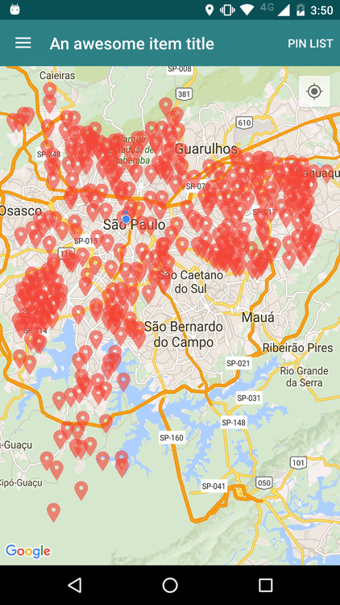

# simple-map-android
A simple map app to help you getting started with android development using the Google maps API for android
###Getting started
Clone the repository and import the project in Android Studio, you can try the app installing the `simple_map_app.apk` available in the project root.

###Dependencies
The depdendencies for the project are described in the Gradle script `build.gradle` of the app, just sync the project in Android Studio and you are ready to go :)

List of libraries used in the project so far
- [EventBus](https://github.com/greenrobot/EventBus) - Android optimized event bus that simplifies communication between Activities, Fragments, Threads, Services, etc.
- [Butterknife](https://github.com/JakeWharton/butterknife) - A view injection library that makes the binding between views, methods and resourses declared in XML and the activities/fragments classes.
- [Retrofit/OKhttp](http://square.github.io/retrofit/) - A type-safe REST client for Android and Java
- [Gson](https://github.com/google/gson) - Gson is a Java library that can be used to convert Java Objects into their JSON representation.

###Running it
You can [build and run](https://developer.android.com/tools/building/building-studio.html) the project using the Android Studio/Gradle. You need an [android emulator](http://developer.android.com/tools/devices/emulator.html) or a [real device](http://developer.android.com/tools/device.html) to test the build.

###Screenshots

